# تحلیل داده‌های هواشناسی و الگوهای بارش در شهرهای ایران

##  معرفی پروژه

این پروژه با هدف تحلیل داده‌ های هواشناسی در سه شهر تهران، قم و رشت، در بازه زمانی 2020 تا 2024 انجام شده است. تمرکز اصلی پروژه بر پیدا کردن یک الگوی بارشی در هر فصل است. به همین منظور عوامل متعددی از جمله دما، میزان بارش(برف و باران) و طول روز را بین سه شهر را بررسی کرده تا عواملی که تاثیر بیشتری بر الگوی بارشی دارند را بتواینم پیدا کنیم. این پروژه از بخش های مختلفی تشکیل شده است که بصورت کامل در ادامه توضیح داده خواهد شد.
##  پیش‌نیازها

برای اجرای این پروژه نیاز به نصب پکیج‌ های زیر دارید که در فایل `requirements.txt` نیز آمده است:

```
pandas~=2.3.1
numpy~=2.3.1
seaborn~=0.13.2
matplotlib~=3.10.3
jdatetime~=5.2.0
tabulate~=0.9.0
scikit-learn~=1.7.0
```

نصب با دستور:
```bash
pip install -r requirements.txt
```

## مراحل انجام تحلیل

### 1. خواندن داده‌ ها
داده‌ های هواشناسی از فایل `weather.csv` بارگذاری شده‌ اند. این داده‌ ها از سایت [open-meteo](https://open-meteo.com/en/docs) دانلود شده‌ اند و برای این‌ که نتایج ارزیابی دقیق‌ تر باشد، دیتای ۵ سال در پروژه در نظر گرفته شده است.

### 2. بهینه ‌سازی داده ‌ها
برای کاهش حجم فایل داده از تابع  `auto_data_type`  استفاده شده است که همه داده ها را بررسی کرده و آن ها را به دیتا تایپی که باعث می شود حجم کمتری بگیرد و داده ای از بین نرود، تبدیل کند. این کار باعث می شود حافظه کمتری مصرف شود. هم چنین وجود داده های تکراری و خالی نیز بررسی شده است و به این علت که داده ها به صورت روزانه داده شده است، در این مورد داده ای با این شرایط نداریم. همان طور که در شکل زیر مشخص است پس از تبدیل نوع داده ها با کاهش حجم حدود 43 درصد مواجه شدیم.

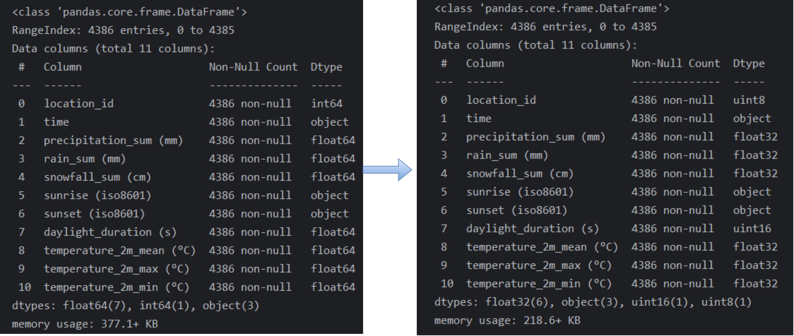


### 3. تشخیص داده ‌های پرت و حذف آن ها 
بر اساس نمودار زیر می توان نتیجه گرفت که در شهر رشت چند داده پرت وجود دارد. به عبارتی دیگر در بعضی از روز ها بارش غیر معمول وجود داشته است. به همین خاطر برای این که داده ها را در شرایط نرمال بررسی کنیم، این داده ها را حذف می کنیم. حذف داده های پرت با استفاده از میانگین و انحراف معیار انجام شده است که داده هایی در بازه [میانگین - ۳ * انحراف معیار, میانگین + ۳ * انحراف معیار]  هستند را نگه می داریم. ضریبی که برای انحراف معیار در نظر گرفته شده است می تواند بر اساس داده ای دیگر تغییر کند.

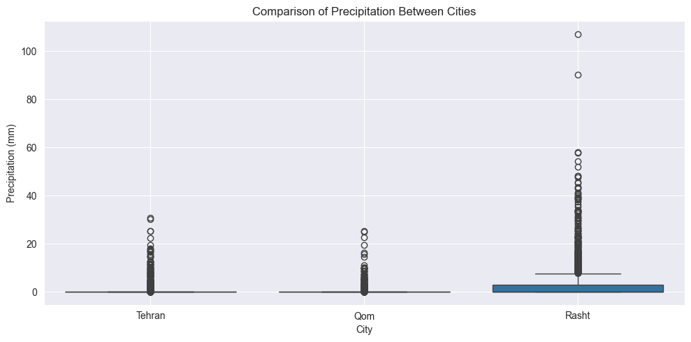


### 4.   استخراج ویژگی
برای این که بتوانیم تحلیل دقیق تری در هر فصل داشته باشیم، از ستون time اطلاعاتی از جمله سال میلادی ، ماه میلادی، فصل میلادی استخراج و به مجموعه داده‌ها اضافه شد. سپس، با استفاده از کتابخانه jdatetime، تاریخ‌ها به معادل شمسی تبدیل شده‌اند تا درک بهتری از الگوهای فصلی داشته باشیم. این مرحله به ما در تحلیل های ماهانه، فصلی و سالانه کمک می کند.
### 5.   نرمال سازی

برای این که بررسی دقیق تری بر روی میزان بارش ها داشته باشیم، ابتدا نمودار توزیع داده ها بر روی کمیت مجموع بارش ها بررسی می کنیم. همان طور که مشاهده می شود چون میزان بارش شهر رشت به مراتب بیشتر از تهران و قم بوده است، مقایسه مستقیم این مقادیر ممکن است باعث گمراهی در تحلیل شود نمودار زیر بصورت میانیگین بارش ماهانه در هر شهر رسم شده است. برای حل این مشکل، از نرمال‌سازی به روش Min-Max Scaling استفاده شده است. این روش، مقادیر بارش را به بازه‌ ای بین ۰ و ۱ تبدیل می‌کند تا نتایج تحلیل دقیق تر شود.

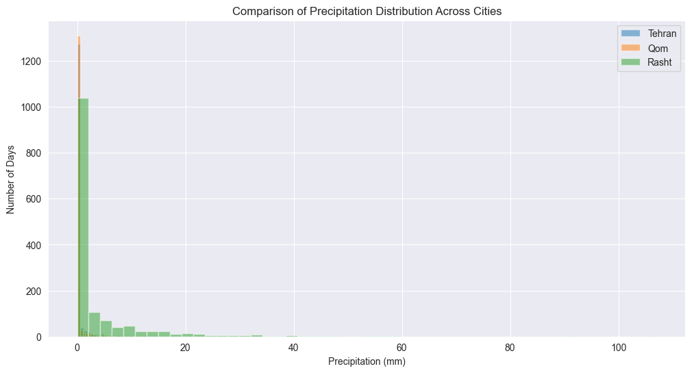


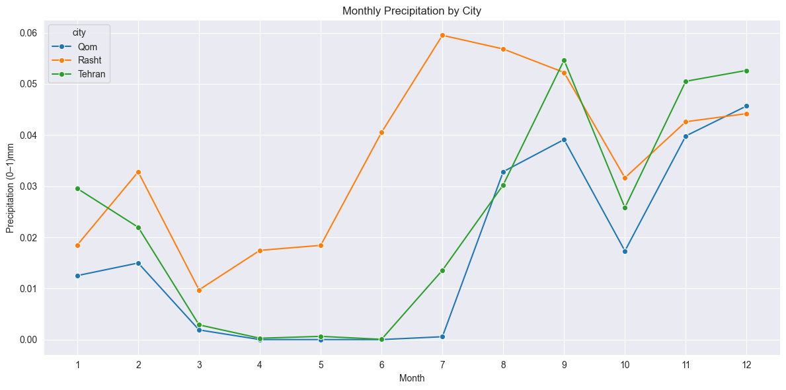


### 6.  پیدا کردن عوامل موثر
### 6-1. بررسی همبستگی ویژگی‌ها 

با استفاده نمودار heatmap می توان نتیجه گرفت که بین دما و میزان بارش همبستگی قوی ای وجود دارد و ارتباط بین آن ها نیز معکوس است. بطور مثال هر چه دما پایین تر باشد میزان بارش بیشتر است و بالعکس. همچنین با استفاده از پلات زیر هم می توان نتیجه گرفت که بیشتر بارش ها در فصل های پاییز و زمستان در هر سه شهر رخ داده است. نتایج دیگری که می توان گرفت این است که با کاهش دما، احتمال وقوع بارندگی افزایش می‌یابد و دما با طول روز رابطه مثبت و قوی دارد و بیشتر بارش‌ها از نوع باران است.

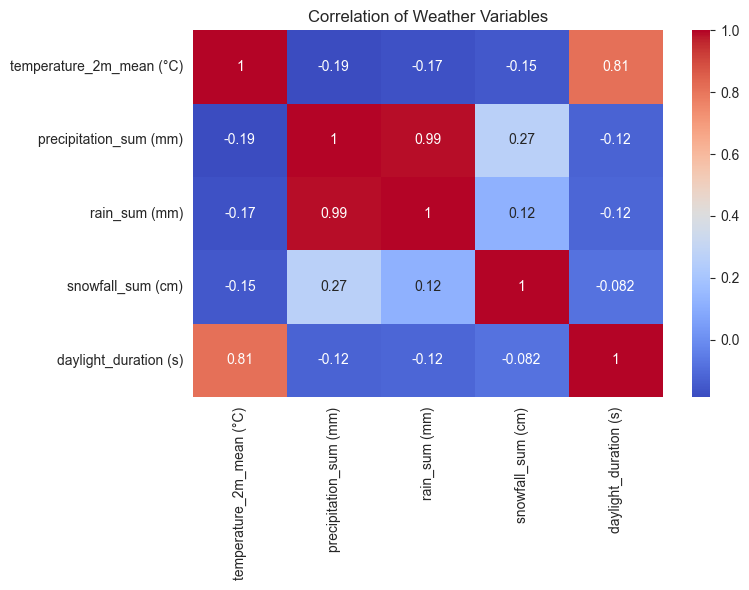

### 6-2. مقایسه کمیت ها بین شهرها 

برای تحلیل بهتر روابط بین کمیت ها، نمودار زیر رسم شده است که در آن دمای میانگین، بارش کل، باران، برف و مدت زمان روشنایی روز به تفکیک شهرها  بررسی و نمایش داده شده ‌است. از این نمودار می توان استنباط کرد که در بین هرسه شهر، رابطه  قوی بین دما و مدت روشنایی روز دیده می‌شود. همچنین، مشخص است که در شهر رشت میزان بارش‌ها و باران‌ها بیشتر و داده‌های پرت بیشتری در متغیرهای بارشی دارد. در حالی که تهران و قم بیشتر روزها بدون بارش یا بارش کم دارند.

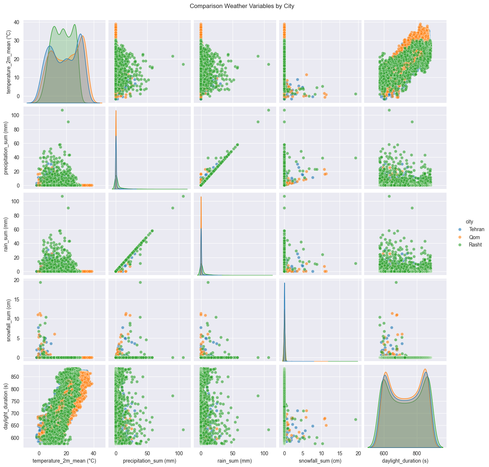

### 6-3. بررسی بارش ها در شهر ها

از نمودار های زیر می‌توان نتیجه گرفت که رشت در تمام طول سال به ‌مراتب پربارش ‌تر است و اوج بارش آن در اواخر پاییز و زمستان (آبان، آذر، دی و بهمن) رخ می‌دهد، در حالی که قم و تهران در اغلب ماه ‌ها بارشی ندارند و تنها در فصل زمستان (دی تا اسفند) کمی بارش دارند. پس انتظار می‌رود رشت در الگوی بارشی همیشه اولین شهر باشد.
<p align="center">
  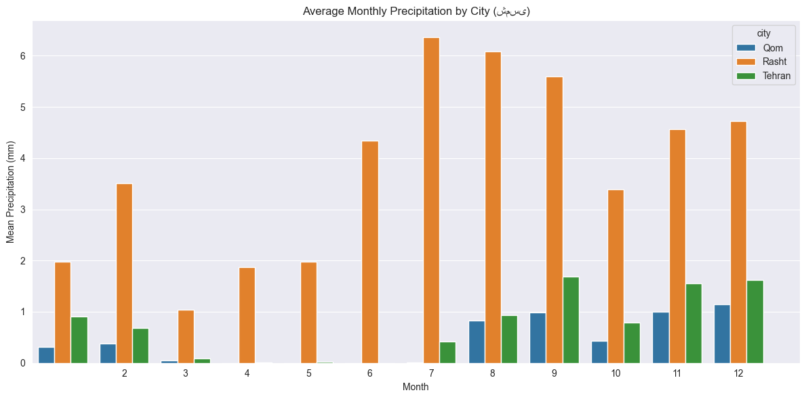
  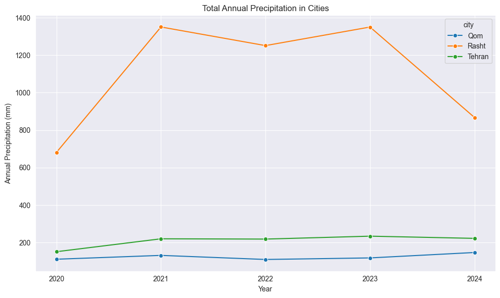
</p>

در نمودار زیر مشاهده می شود که در هر سه شهر بیشتر روز ها یا بارانی هست یا خیلی کم باران می‌ بارد، و فقط شهر رشت در یک سری از روز ها پر بارش یا برفی است.
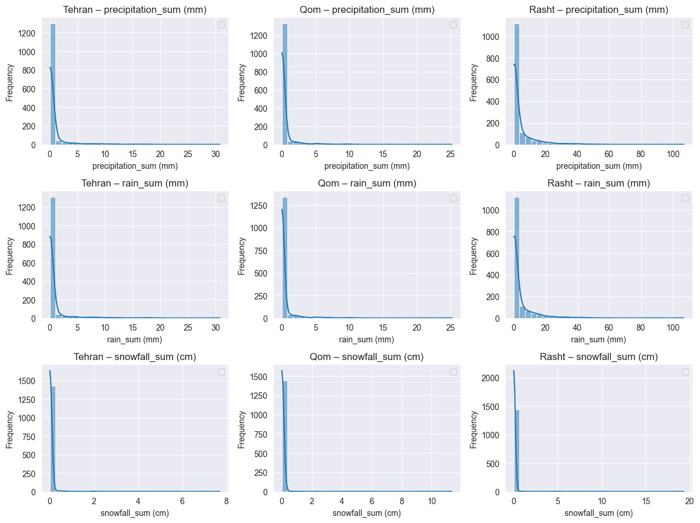

 نمودار زیر نشان می‌دهد که رشت در تمامی سال‌ها و فصل‌ها، به‌ویژه در پاییز و زمستان، بیشترین میزان بارش را داشته است. در حالی که قم کم‌ باران‌ترین شهر بوده و تنها در فصل های سرد بارش قابل‌ توجهی داشته است. تهران نیز بارش های متعددی داشته و در برخی سال‌ها مانند ۲۰۲۴ زمستان پر بارش‌ تری را تجربه کرده است.
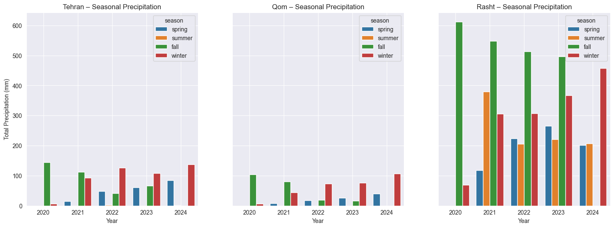


از دو نمودار زیر استنباط می شود که ارتباط (همبستگی) دما بین همه‌ شهرها بالا است، مخصوصاً تهران و قم  .بارش فقط بین تهران و قم ارتباط نسبتا قوی ای دارد.
<p align="center">
  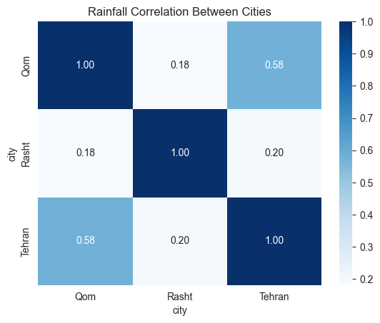
  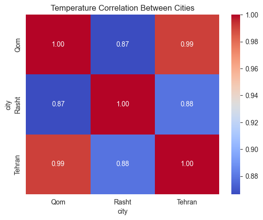
</p>


## 📊 نتایج پروژه
### محاسبه تاخیر بارش بین شهر ها

جدول زیر نشان دهنده تاخیر بارش ها در بین استان ها است. که از صفر روز به نشان بارش در همان روز تا 3 روز آتی را بررسی کرده ایم. در تأخیر صفر روزه، همبستگی بارش بین تهران و قم بسیار بالا است (۰.۵۷)، که نشان ‌دهنده وقوع هم‌ زمان بارش در این دو شهر است. در تأخیر یک روزه، برخی همبستگی‌ های ضعیف (مانند قم به تهران با ۰.۲۶) دیده می‌شود، اما این مقادیر برای نتیجه ‌گیری قطعی کافی نیستند. با افزایش تأخیر به دو و سه روز، میزان همبستگی به ‌طور قابل ‌توجهی کاهش یافته و پس رابطه زمانی معنا داری بین شهرها وجود ندارد.

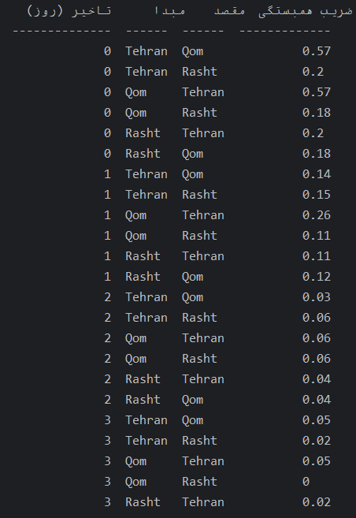


نمونه خروجی جداول توالی بارش ها به تفکیک هر فصل:
همان طور که در تصویر زیر مشاهده می کنید به تفیکی هر فصل الگو های بارشی استخراج شده است. با استفاده از داده ها، زمانی که بارش در هر شهری شروع می شود این را به عنوان نقطه ابتدایی در نظر گرفته می شود و در روز ها آتی بررسی می شود که در چه شهر های دیگری بارندگی رخ می دهد. با استفاده از این روش در هر فصل به یک سری از الگو های بارشی می رسیم. همان طور که در عکس زیر مشاهده می کنید برای هر الگویی که پیدا شده است، تعداد دفعاتی که این الگو در آن فصل و در سال های 2020 تا 2024 رخ داده است را محاسبه می کنیم. در پایان الگویی که بیشترین تکرار را داشته است به عنوان الگوی رایج در آن فصل در نظر گرفته شده است.
### پیدا کردن الگوی فصلی بارش

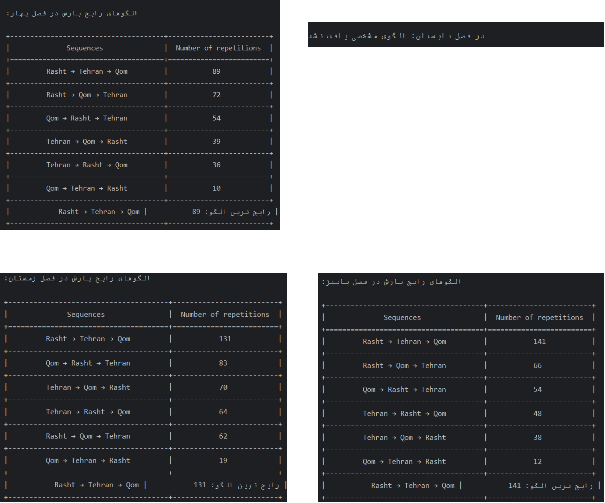

لازم به ذکر است که در فصل تابستان چون عمدتا بارشی رخی نداده است، در نتیجه الگوی بارشی ای یافت نشده است.

## 📁 ساختار پوشه‌ها

```

weather-analysis/
│
├── README.md
├── sample.ipynb 
├── requirements.txt 
├── weather.csv 
│
└── images/ 
├── pre_processing.png 
├── outlyer.png 
├── scaling.png  
├── heatmap.png 
├── Average_precipitation.png 
├── Annual_precipitation.png 
├── precipitation.png 
└── output.png 
```
